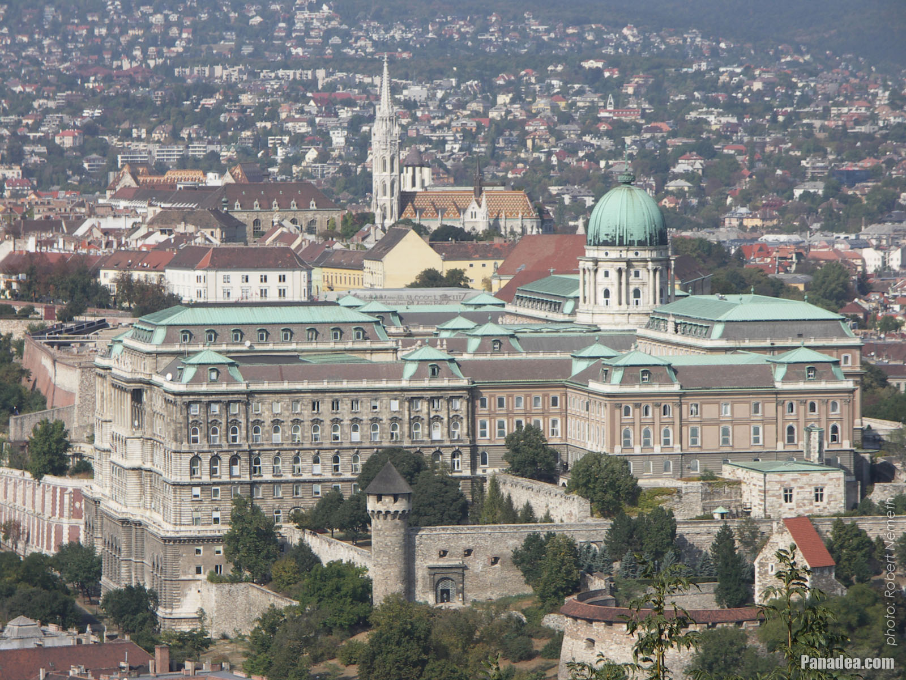
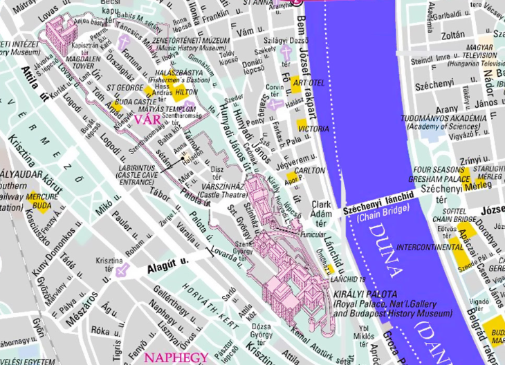
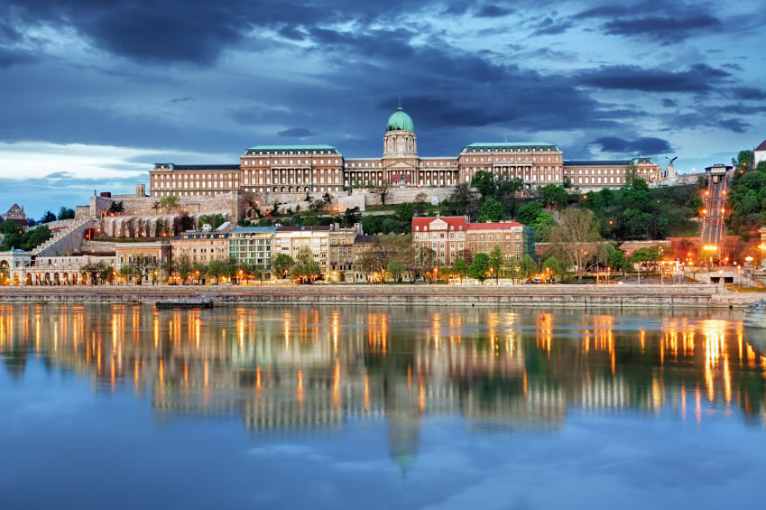
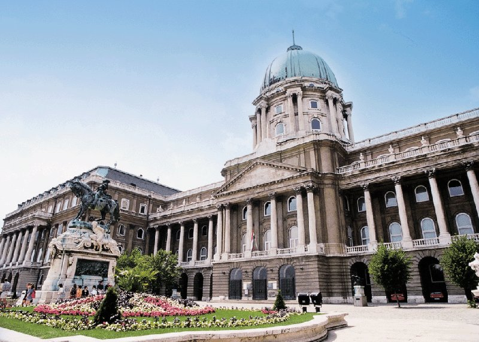
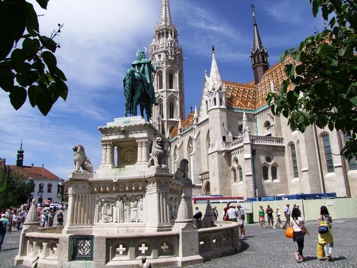
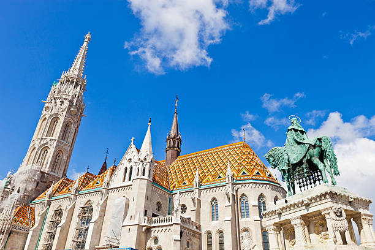
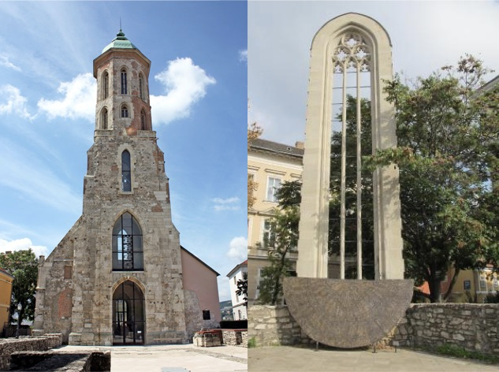
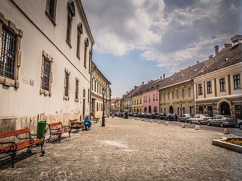

### Burcht en oude stad

De burcht van Budapest, die zo'n 50 meter boven de Donau uitsteekt, bestaat uit 2 delen: het koninklijk paleis (Budavari Palota) en de wijk (Varnegyed). Het koninklijk paleis dat je nu te zien krijgt dateert uit het einde van de 19e eeuw. Na een klim, te voet of met de tandradbaan, kan je genieten van een prachtig uitzicht over het stadsdeel Pest.

#### Overzichtskaartje van de Burcht en oude stad

#### Burcht van Boeda

##### Geschiedenis

De Burcht ligt op een plateau en het gehele complex bestaat uit tientallen historische en architectonische waardevolle gebouwen en vele nauwe straatjes en steegjes, waarvan de loop sinds 7 eeuwen niet is veranderd. Met de bouw van de Várhegy-Bástya en vesting werd na de invasie van de Mongolen in 1241 begonnen. In het jaar 1255 gaf koning Béla IV opdracht een burcht alsmede een stad voor de bewoners van het verwoeste Pest te bouwen. Kasteel en stad werden gescheiden van elkaar gebouwd en door enorme vestingwallen omringd. Onder koning Matthias Corvinus werd de Burcht Boeda een centrum van kunst en wetenschap, waarvan onder de Turkse heerschappij in de 16e eeuw een einde kwam. De Turkse heersers noemden Boeda de "Gouden Oogappel" van hun rijk, maar doemden haar toch tot verdwijnen. Alleen de vestingsmuren werden door hen vernieuwd. Tijdens de belegering van Boeda in 1686 werd de Burcht vernield en op de ruïnes werd een kleine barokstad gebouwd, als domicilie van de Habsburgse heersers. In plaats van de oude Burcht verrees een klein slot dat echter nooit door keizerin Maria Theresia werd bewoond. Keizer Jozef II liet een theater bouwen. Het Franciscanerklooster werd zetel van de landdag, maar tijdens het eerste deel van het Habsburgerse tijdperk was de stad Boeda nog geen hoofdstad. Tijdens een opstand, op 21 mei 1849 veroverden de Honvéd (burgerwacht) de Burcht al na één enkele stormloop. Na het herstel van de orde werd met man en macht gewerkt aan het herstel van de oude glorie.

Dit karakteristieke gebouw met een façade van meer dan 300 meter en de zeer opvallende hoge koepel, is van overal in Boedapest te zien. Vooral van de linker Donau-oever biedt het een imposante aanblik. De Burcht was in de 14e eeuw zetel van de koning. In de 18e en 19e eeuw vonden grote uitbreidingen plaats, gelijk met de Burchtstad Boeda. Tijdens de gevechten van december 1944 tot februari 1945 werd een groot deel van het Burchtpaleis verwoest. Nadat Pest van de Duitsers was bevrijd, hielden de Duitse troepen zich nog een paar weken staande tegen de verwoed aanvallende Russische legers.
Na de Tweede Wereldoorlog lag de vesting weer in puin, elk huis was zwaar beschadigd, het koninklijk paleis afgebrand. Een geluk bij een ongeluk was dat de archeologen onder de puinhopen de middeleeuwse burcht van Boeda ontdekten, de mortel van de barok viel van de muren en gotische ramen en deuren kwamen bloot te liggen. Onder de resten van het neobarok paleis vond men overblijfselen van een renaissance slot. De werkzaamheden, die tot 1970 voortduurden, hebben tientallen nevengebouwen herschapen tot het culturele centrum van de oude stad. Na meer dan 30 jaar is de Burcht voor het grootste gedeelte in zijn oude glorie hersteld. Het stadsbestuur besloot de gebouwen als museum in te richten.

##### Bezienswaardigheden

Vanaf het Disz tér komt men aan de toegangspoort. Op het terrein van de Burcht is het museum van de Hongaarse Arbeidersbeweging, in vleugel A. Hier is aanschouwelijk weergegeven de geschiedenis van de Hongaarse industrie, de nijverheid, de mijnbouw en de daarmee samenhangende problemen vanaf de eerste helft van de 19e eeuw. In de vleugels B, C en D is de **Hongaarse Nationale Galerie** ondergebracht. Deze enorme zalen vormen de hoofdvleugels van het vroegere slot. Hier ziet men beeldhouwwerk, fresco's, altaarbeelden uit de romaanse en gotische periode en uit de renaissance. Ook de laatrenaissance en barok zijn er ruim vertegenwoordigd. In dit museum, met een rijke kunstverzameling en prachtige zalen, worden nog steeds stukken aan de verzameling toegevoegd.

In het zuiden worden de hooggelegen Burchtwijk en het Burchtpaleis omsloten door gerestaureerde, rond lopende middeleeuwse verdedigingsmuren. Ze worden onderbroken door torens, schietgaten en kantelen. Ook de gietijzeren kanonnen getuigen van weleer.

En nog veel meer:

- Matthiasfontein
- Leeuwenpoort
- Sierpoort

#### Hongaarse Nationale Galerie

De Nationale Galerie is het grootste museum van Hongarije met 8000 vierkante meter en er is dan ook ontzettend veel te zien. Alleen al de lijst met de permanente tentoonstellingen in het Hongaars Nationaal Museum is ellenlang, met aandacht voor de geschiedenis van Hongarije vanaf de stichting van de staat tot 1990, Hongaarse geleerden uit de 20ste eeuw, het Romeins lapidarium, het middeleeuwse en vroegmoderne lapidarium en de eerder genoemde kroningsmantel. Zorg ervoor dat je een paar uur uittrekt voor dit museum! 

##### Kunst

In dit museum is ook een van de belangrijkste collectie Hongaarse kunst te vinden. In 1845 werden de plannen voor de oprichting van de Nationale Galerie in het leven geroepen, wat in 1846 resulteerde in de eerste tentoonstelling. Met het verkrijgen van de kunstverzameling van de familie Esterházy in 1870 werd de basis gelegd voor de belangrijke en steeds groeiende kunstverzameling. 

Boedapest_musea-nationale-galerie.jpgHet indrukwekkende gebouw herbergt verschillende waardevolle relikwieën uit de geschiedenis van Hongarije, zoals de bijna duizend jaar oude kroningsmantel en de kroonjuwelen. Je leer er alles over de geschiedenis van Hongarije uit de tijd van koning St. Stefanus tot aan het millennium en de geschiedenis van Hongarije in de 20ste eeuw. 

Op de begane grond staan middeleeuwse stenen beelden en gotische houtsculpturen. Op de eerste verdieping zijn werken uit de Renaissance, de Barok en vooral uit de 19de eeuw te bewonderen. De schilderijen van Mihály Munkácsy - de schilder van Hongaars Duitse afkomst heette oorspronkelijk Michael Lieb – hangen in een aparte zaal. Munkácsy (1844-1900) werkte in Wenen, München en Düsseldorf en leefde als gevierde bohémien lange tijd in Parijs. Hij was de enige Hongaarse kunstenaar van de 19de eeuw die internationale bekendheid had. 

Wat je zeker niet mag missen is de piano die vroeger van Franz Liszt en Beethoven is geweest, onderdeel van de permanente historische tentoonstelling!

##### Restaurant tip

Het museumcafe ligt op een steenworp afstand van de Nationale Galerie en is een van de beste restaurants in Boedapest. Je vindt er traditionele gerechten met een modern tintje, zeer welkom na een lange middag rondsnuffelen in het museum!

#### Oude stad van Boeda

De oude stad van Boeda ontwikkelde zich van de 13de eeuw ten noorden van het Koninklijk Paleis, en bloeide onder koningen als Sigismund, toen rijke Duitse kooplieden winkels in de Herenstraat openden. Hij werd later door Turken verwoest en daarna door hun overwinnaars, het leger van de Heilige Liga dat uit Europese christenen bestond. Na de tweede wereldoorlog werd hij weer opgebouwd, en overal zijn historische resten te zien.

Wat valt er zoal te zien?

- Staatsarchief
- Mihály Táncsics-straat
- Maria Madgalenakerk
- Herenstraat
- Matthiaskerk
- Standbeeld van Sint-Stefan
- Vissersbastion
- Heilige Drie-eenheidplein
- Gouden Arend Apotheekmuseum
- Rotsziekenhuis in het Atoombunkermuseum
- Hilton Hotel
- Militair Museum

#### Matthiaskerk

De oorspronkelijke Onze-Lieve-Vrouwekerk werd in 1255 onder koning Béla IV voltooid en in de 14e en 15e eeuw regelmatig uitgebreid. Zo ontstond in 1470 onder koning Matthias de zuidelijke toren.

Onder de Turken, vanaf 1541, werd de kerk veranderd in een moskee. Hierbij werden het interieur en de fresco's aan de muren en het plafond verwoest. Bij de herovering van Boeda door de Habsburgse legers (1686) leed de kerk opnieuw ernstige schade. In het begin van de 18e eeuw vonden de herstelwerkzaamheden plaats, waarbij barokke stijlelementen werden aangebracht. De kerk was in deze periode in het bezit van achtereenvolgens de franciscanen en de jezuïeten.

Tussen 1873 en 1896 werd de kerk door Frigyes Schulek grondig verbouwd en kreeg ze haar huidige neogotische aanzien. Tijdens de Tweede Wereldoorlog werd de kerk opnieuw zwaar getroffen. Bij de restauraties ging men weer uit van de gotische versie. Het exterieur is juist weer gerestaureerd en ook het interieur kreeg een beurt. Vooral het dak met zijn kleurige leien herinnert aan de fayence-cultuur uit de tijd van koning Matthias.

Behalve de genoemde 80 meter hoge, achthoekige gotische klokkentoren, is links de kleinere Béla-toren met een kleurrijk geglazuurd dak van majolicategels. Ter hoogte van de derde verdieping is het Hongaarse wapen gecombineerd met het familiewapen van koning Matthias te zien. Tussen beide torens bevindt zich een neogotische geveldriehoek en een opvallend rozetraam.

Het Mariaportaal met een reliëf uit de 14e eeuw, met taferelen uit Maria's leven, is de grote ingang van de kerk. In de drieschepige kerk vallen onmiddellijk de fraaie beschilderingen aan het plafond en de gotische zuilen op. Links na de ingang bevindt zich een opvallende oratorium. De gebrandschilderde ramen stellen Hongaarse heiligen voor. Rechts van het hoofdaltaar leidt een trap naar de crypte en de schatkamer.

De Stefanuskroon en de andere koninklijke insignes zijn namaak, de originelen bevonden zich tot enkele jaren geleden in het Hongaarse Nationaal Museum. Tegenwoordig zijn ze in het parlement te bewonderen. In de kerk worden ook regelmatig orgelconcerten gegeven.

In 1867 werd het Oostenrijkse keizerspaar Frans-Jozef en Elizabeth (Sisi) hier gekroond.

#### Maria Madgalenakerk

De Maria Magdalenakerk in Boedapest is een kerkruïne uit 1274, waarvan de toren er nog staat. Deze kerk stond in de Burcht van Boeda. Dit was in de middeleeuwen de kerk waar de Hongaren uit Boeda naar de kerk gingen; de Duitsers gingen naar de Matthiaskerk. Toen Boeda in de 16e eeuw werd veroverd door de Turken, werd de kerk in 1541 verbouwd tot moskee.

Toen Boeda in 1686 werd terugveroverd op de Turken door de Oostenrijkers onder leiding van prins Eugenius van Savoye, werd de kerk daarbij beschadigd. De franciscanen kregen het gebouw toegewezen. Zij herbouwden de kerk in de barokke stijl. De kerk werd heropend en gewijd in 1698.

Tijdens de verovering van Boedapest door het Rode Leger in 1945 werd de kerk opnieuw erg beschadigd en sindsdien is het een ruïne, op de toren na, want deze is herbouwd.

#### Herenstraat

Deze straat doorsnijdt de Burchtwijk in de lengte.
