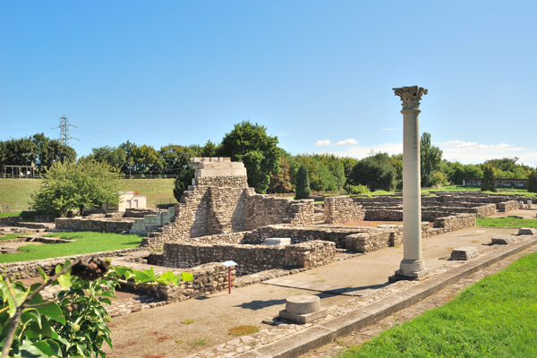
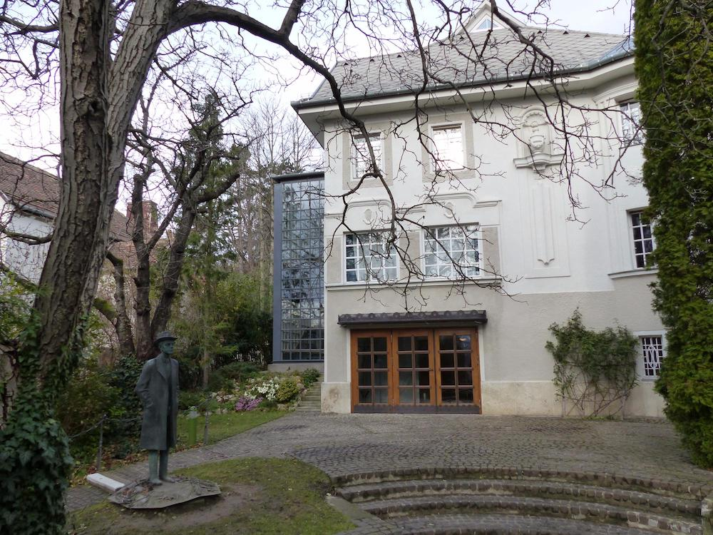

## Er is nóg meer...

#### Aquincum

Aquincum was een Romeinse stad aan de Donau. De nederzetting werd in het jaar 89 gesticht en is een voorganger van de Hongaarse hoofdstad Boedapest. De resten ervan zijn te vinden in Óbuda, in het noorden van het op de rechter Donauoever gelegen stadsdeel Boeda.

Aquincum was in eerste instantie een verdedigingswerk tegen de Kelten die aan de andere kant van de Donau woonden. Vanwege de gunstige ligging groeide Aquincum uit tot het industriële en economische hart van de Romeinse provincie Pannonia, waarvan het grondgebied een groot deel van het tegenwoordige Hongarije besloeg. De bloeitijd van Aquincum lag rond het jaar 200.

Vanaf 1880 is de stad weer langzaam opgegraven. Tegenwoordig is Aquincum een openluchtmuseum. Het honderd meter noordelijker gelegen amfitheater is vrij toegankelijk.

#### Bela Bartok huis

Bartók studeerde onder andere aan de Lisztacademie in Boedapest. Nadat hij daar was afgestudeerd, werd Bartók concertpianist en – in 1907 – docent piano in Boedapest.

In 1988 werd het stoffelijk overschot van Bartók overgebracht naar Hongarije en bijgezet op het Farkasreti-kerkhof te Boedapest.

#### Holocaust Memorial Center

De Holocaust maakt een groot deel van de geschiedenis van Budapest uit. In dit museum wordt dit heel erg voelbaar en zichtbaar.