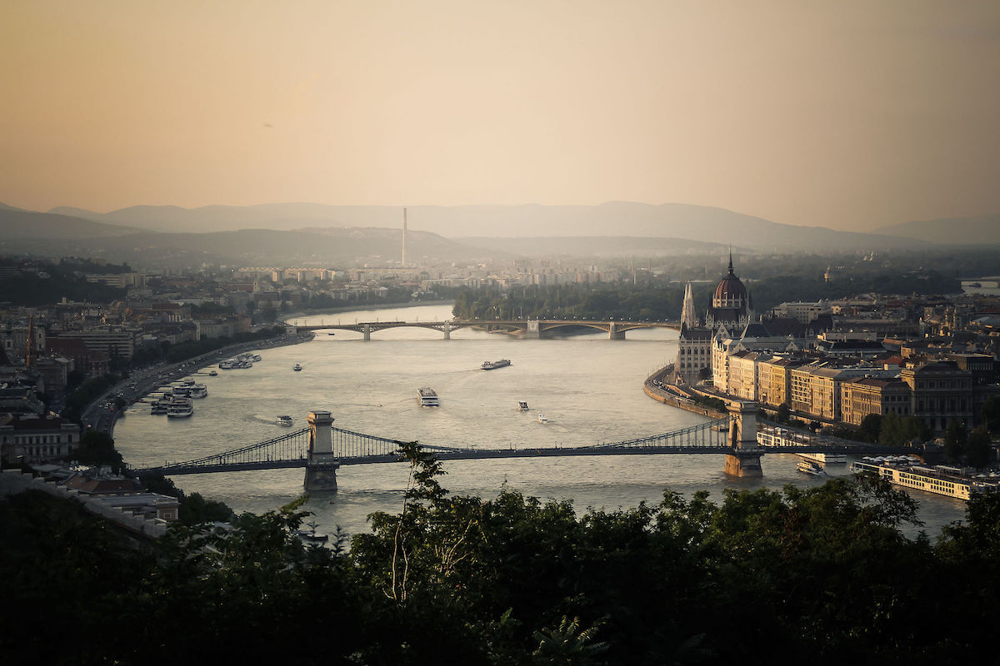
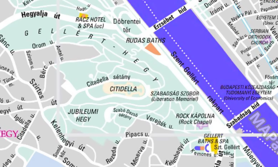
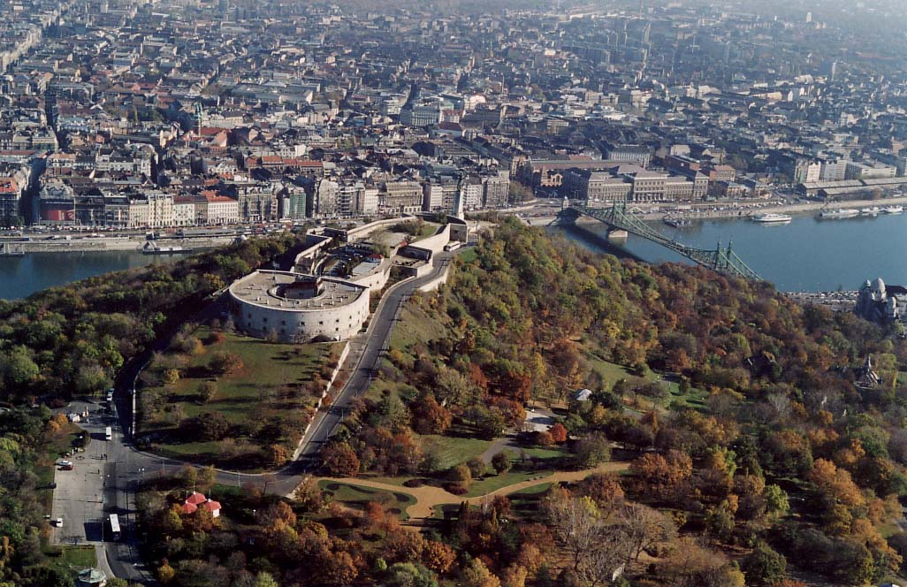
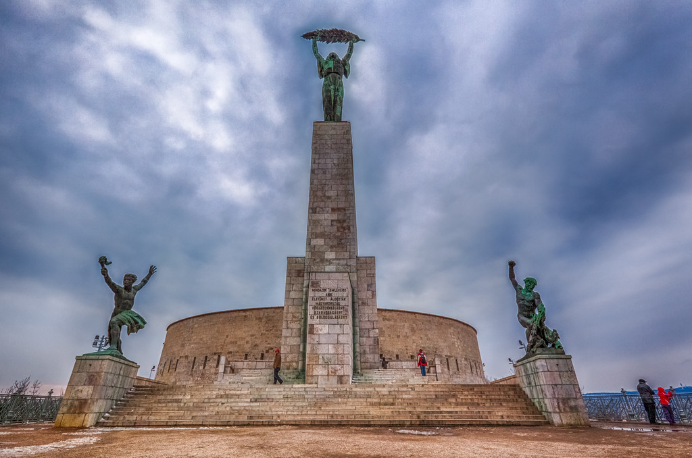
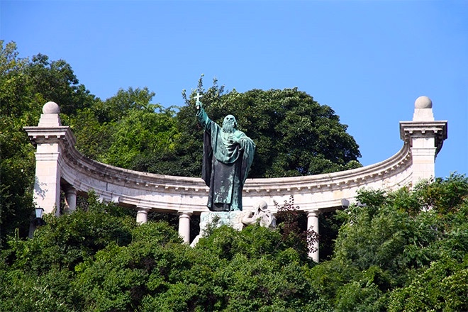
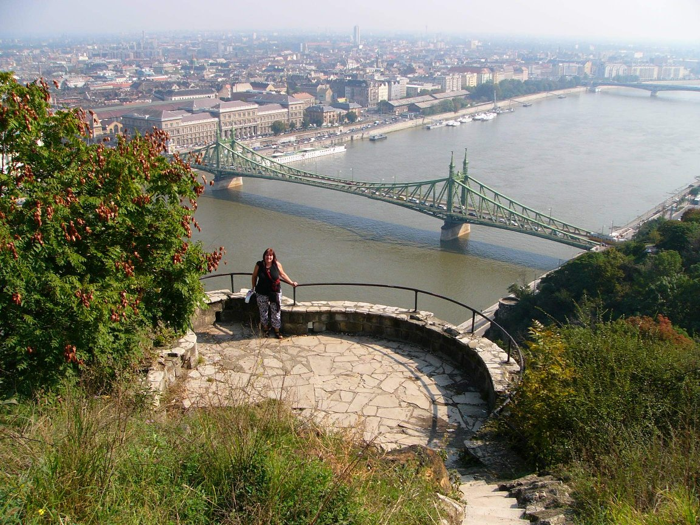
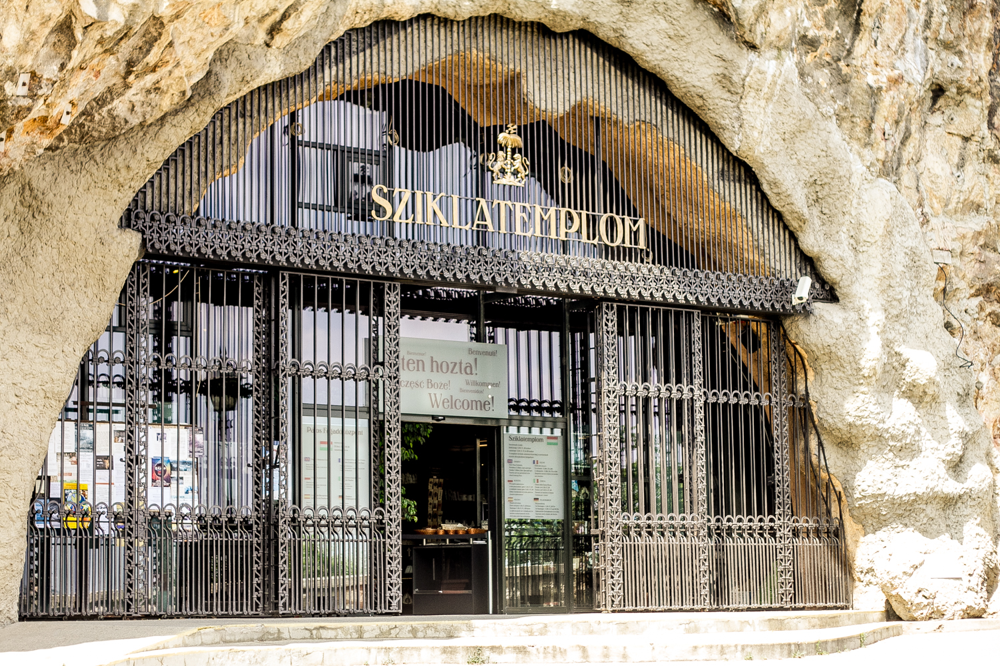
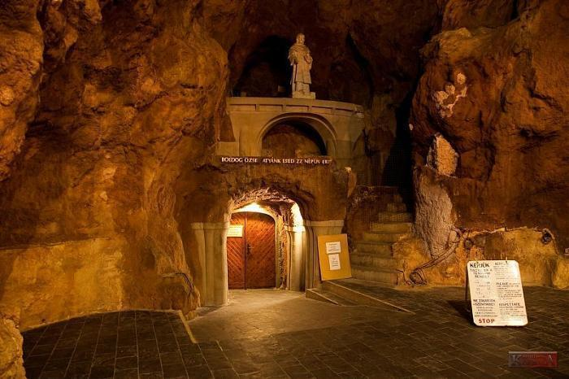
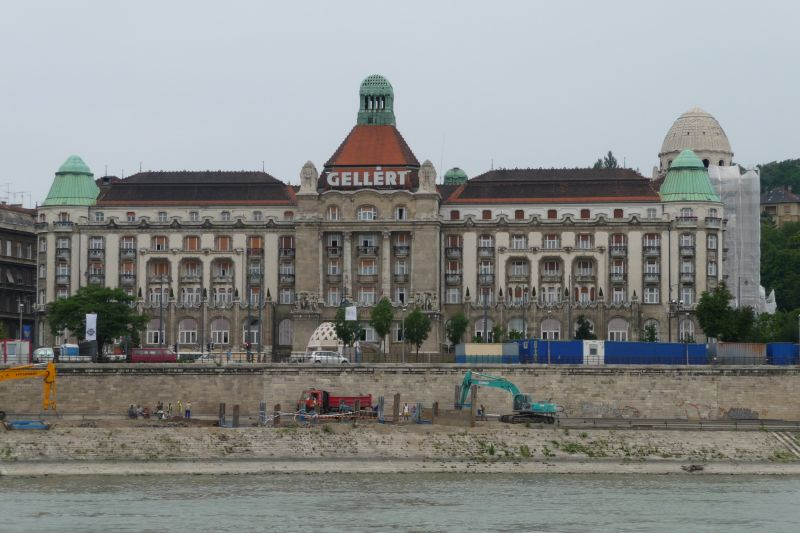

## Gellért-hegy

De Gellértberg is gelegen aan de kant van Boeda. De berg draagt de naam van de heilige Gellért, die hier de marteldood vond. De Gellértberg of heuvel (235 m hoog) ligt tussen de Vrijheidsbrug en de Elisabethbrug en aan de Hegyalja út.

De naam Gellért stamt van bisschop Gerardus (Gerhard, Gerard), een Venetiaan die geestelijk adviseur was van de eerste christelijke Hongaarse koning Stefanus I van Hongarije. De opstandige heidense Magyaren (Hongaren) zouden hem hier in 1046, na de dood van koning Stefan I, hebben vermoord. Op de plaats waar Gellért – vermoedelijk in een met spijkers dichtgemaakt vat – van de rotswand naar beneden werd gegooid, plaatste men in 1904 een beeld van hem. Hij houdt in de rechterhand het kruis en aan zijn voeten knielt een bekeerde heiden. Szent Gellért lijkt de stad Boedapest te zegenen.

Vlak eronder is een waterval aangebracht die ontspringt vanuit een natuurlijke bron. Het bekken waar het water in valt, is rood gekleurd, waardoor het water bloedkleurig lijkt, als het bloed dat de Heilige Gellért daar heeft vergoten.

#### Overzichtskaartje van Gellért

#### Citadel

De Citadel van Boeda (Citadella) is een vesting op de Gellértberg die vrijwel het gehele bergplateau inneemt. Het bergplateau is 235 meter hoog.

Om de bevolking van Boedapest angst en ontzag in te boezemen — nadat de Oostenrijkers met behulp van het Russische leger de opstand van de Hongaren onderdrukten — werden er plannen gemaakt om grote verdedigingswerken aan te leggen. Van deze grootscheepse plannen werd alleen de citadel, gebouwd door Hongaarse dwangarbeiders, in 1854 verwezenlijkt. In juni 1854 vestigden Oostenrijkse troepen zich in de citadel. Na 1867, toen Oostenrijk en Hongarije een unie sloten - de Dubbelmonarchie - nam de betekenis van de citadel af. Het stadsbestuur trachtte de citadel het militaire karakter te ontnemen. Pas eind 1899 kreeg het stadsbestuur de citadel in bezit. Een paar maanden later, in 1900, werden de vestingmuren afgebroken.

De vesting ligt om een halfcirkelvormige binnenplaats. De vertrekken zijn in twee gangen gebouwd. In een negental gewelfde vertrekken, vroeger de kazematten, is nu een restaurant gevestigd.

#### Bevrijdingsmonument

Ten oosten van de citadel staat het bevrijdingsmonument, dat ontworpen is door Zsigmond Kisfaludi-Stróbl. Het monument is in totaal 35 meter hoog en is ter herinnering van de bevrijding van de stad, in 1945 door de Russen, opgetrokken. Aan de voet van een 14 meter hoog beeld van een vrouw die een palmtak omhoog houdt, stond /tot 1992/ een bronzen beeld van een Russische soldaat met de rode vlag. Links en rechts hiervan staan twee beelden, waarvan het ene de vooruitgang en het andere de vernietiging uitbeeldt.

#### Jubileumpark

Westelijk van de citadel ligt het grote jubileumpark. Het is eigenlijk een herdenkingspark, aangelegd in 1967 bij de viering van het vijftigjarig jubileum van de Russische Oktoberrevolutie. Boven op de citadel heeft men een panoramisch zicht over de stad, de Donau en zijn acht bruggen.

#### Beeld van Sint Gellért

##### Sint Gellért

Aan het begin van de elfde eeuw ondernam Gellért, de Benedictijnse abt van het San Giorgio Maggiore klooster in Venetië, een bedevaartstocht naar Palestina. Hij werd onderweg aangehouden door de Hongaarse koning Stefan, die hem vroeg om de heidense Magyaren te bekeren tot het christendom. Gellért stemde toe en bleef in het land onder de bescherming van de koning. 

Enkele jaren na de dood van de koning in 1046 namen opstandelingen die een terugkeer naar het heidendom nastreefden de bisschop in Boeda gevangen. Volgens de overlevering werd hij in een ton geduwd die volstak met nagels. Vervolgens werd de ton van de steile heuvel af geduwd. De heuvel heette oorspronkelijk Kelen-hegy (oostheuvel) maar werd later Gellért-hegy genoemd naar de bisschop.

##### Het Monument

In 1904 werd er op de plaats waar Gellért omkwam een monument opgericht. Het bestaat uit een groot standbeeld van de bisschop, ontworpen door de beeldhouwer Gyula Jankovits. Achter het beeld staat een halfronde zuilenrij. Het twaalf meter hoge beeld toont Gellért die triomfantelijk een groot kruis in de hoogte houdt. Aan zijn voeten kijkt een woest ogende Magyaar op naar de bisschop alsof hij door ontzag wordt bevangen. Onder het beeld bevindt zich een mooie artificiële waterval. 

De beste plek om het beeld van Gellért te bewonderen is vanaf de Elisabethbrug. Je kan ook tot vlakbij het bronzen beeld geraken, door aan het einde van de brug een reeks trappen op te klimmen. 

Het monument is vanuit zowat heel Pest te zien, vooral ‘s nachts als het mooi verlicht is.

#### Observatieterrassen

Panorama op de Gellért-heuvel biedt een mooi zicht op het zuidelijke deel van Boeda en op heel Pest.

#### Grotkerk

De Grotkerk (Sziklatemplom) is een kerkgebouw in Boedapest.
Het gebouw stamt uit 1926, en is door Kálman Lux ontworpen. Het is gebaseerd op het Mariaheiligdom Lourdes. Het gebouw was bestemd voor de Paulische Orde, die in 1786 door keizer Jozef II in het Habsburgse rijk was verboden. In 1934 kwamen er 15 paters terug uit Polen.

Hun verblijf duurde tot eind jaren 50, toen de communistische overheid de activiteiten van de orde opnieuw verbood. In 1989 werd de kerk heropend door paus Johannes-Paulus II. Het door Győző Sikota ontworpen granieten altaar werd hierbij ingewijd. Links in de kerk staat een kopie van de Zwarte Madonna van Czestochowa en een afbeelding van een Poolse Arend. Verder hangt er ook een schilderij van de Poolse Sint-Kolbe. Achter de Sint-Stefanuskapel bevindt zich het klooster.

#### Gellért-hotel en baden

*Heeft een terras op de eerste verdieping en begane grond met cafés en restaurants met een fraai uitzicht/*

Hotel Gellért ligt in Boedapest, aan de Boedazijde, ter hoogte van de Sint Gellértheuvel en de Citadel. Hotel Gellért ligt aan het Szent Gellért tér 1, aan de Kelenhgyi út 4, wijk XI en nabij de Vrijheidsbrug (Szabadság-hid). Het hotel diende mede als inspiratiebron voor de film The Grand Budapest Hotel.

##### Badhuis

De geneeskrachtige uitwerking van het hier aanwezige thermaalwater was voor plaatselijke bevolking al 2000 jaar geleden bekend. De Romeinen maakten er hier al gebruik van. In de Middeleeuwen werden in de buurt van de bronnen ziekenhuizen gebouwd. Later bouwden de Turken hier hun baden op.

In Hotel Gellért bevindt zich een overdekt bad en achter het hotel een openluchtbad. In het bad bevindt zich middelmatig radioactief kalkhoudend warm water met een temperatuur van 46° Celsius. Er zijn stoom-, kuip-, koolzuur- en zoutwaterbaden en hete luchtstoomcabines. Men kan er ook geneeskrachtige modderbehandelingen ondergaan. Voorts is er een inhalatorium, een zonne-, een golf- en een sproeibad. Men kan er genezing vinden bij gewrichtsziekten, neuralgie, ontstekingen en ziekten van de ademhalingsorganen. In het watermassagebad zijn nog de Turkse halve maanvormige beugels in de muren bevestigd, om het hoofd in te rusten tijdens de watermassage. Men krijgt een kussentje mee, dat men op de beugels legt om de baders nog meer te relaxen tijdens het luchtbellenmassagebad.

##### Hotel

Het hotel, aan de voet van de Gellértheuvel, was ooit een van de mooiste, modernste en duurste hotels van Boedapest, maar aangezien het sinds de jaren zestig niet is gerenoveerd, zijn de 400 kamers naar huidige begrippen ietwat verouderd. Vanaf de balkons met tafels en planten, ziet men de baders beneden zwemmen. Het badhuisgebouw is ondersteund met 10 dubbele pilaren, waar een lage badkant aan beide zijden is waar de baders kunnen relaxen in de ligstoelen. Vanaf de rijk versierde inkomhal kan men de baders achter glas zien zwemmen. Het hotel is ook in de Turkse stijl ontworpen.