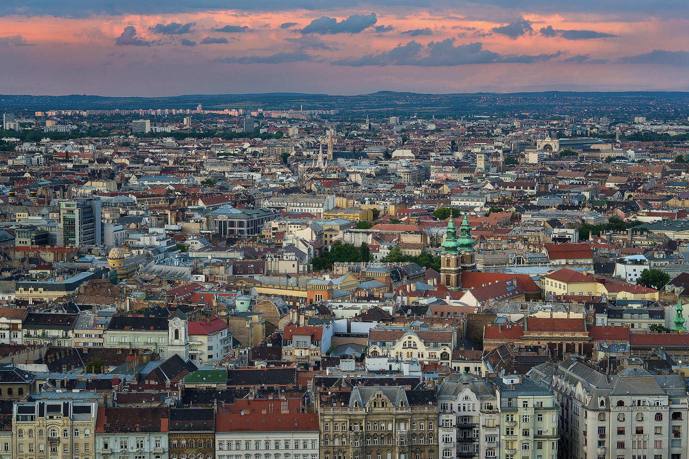
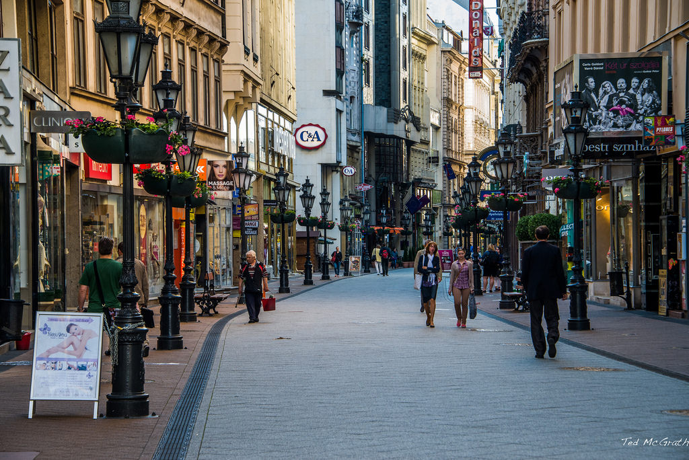
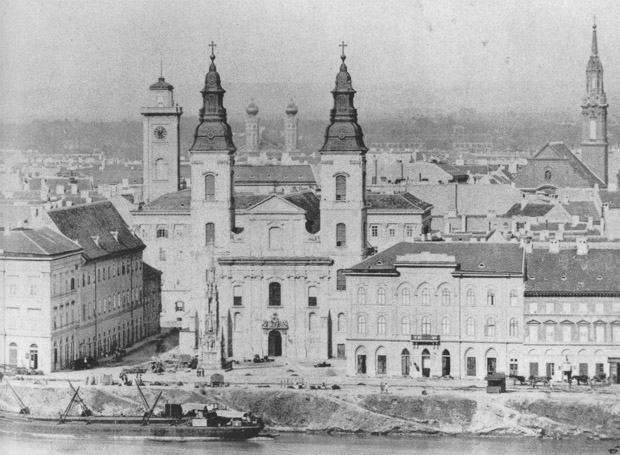
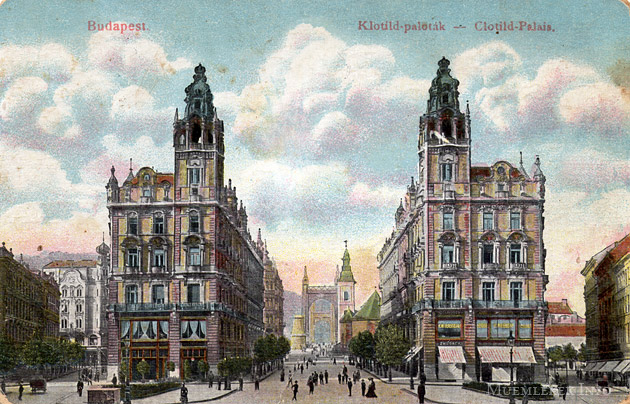
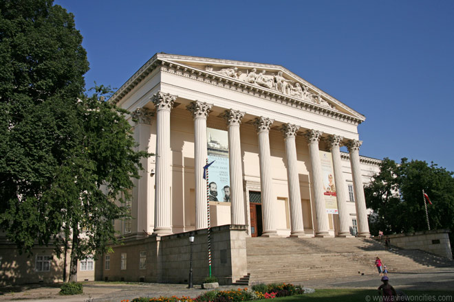
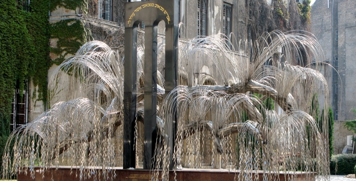
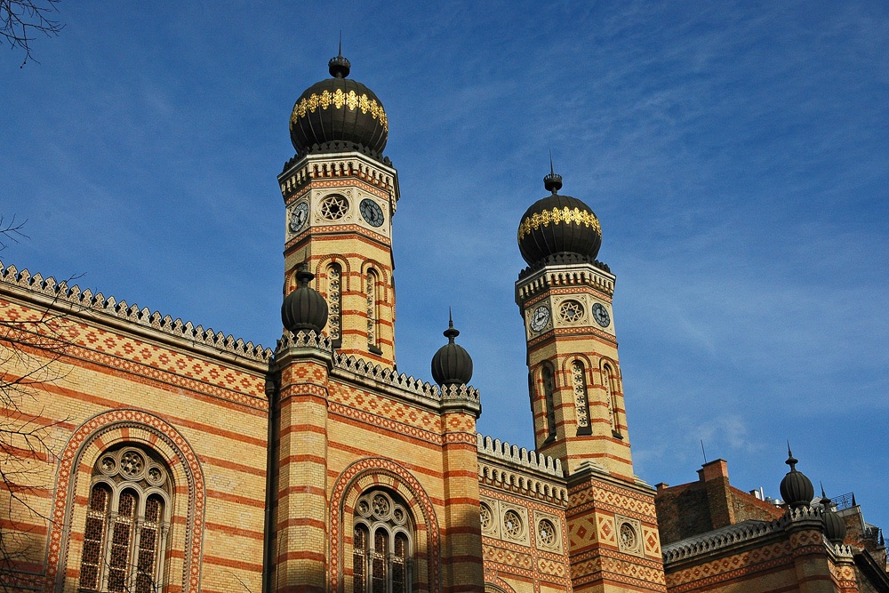
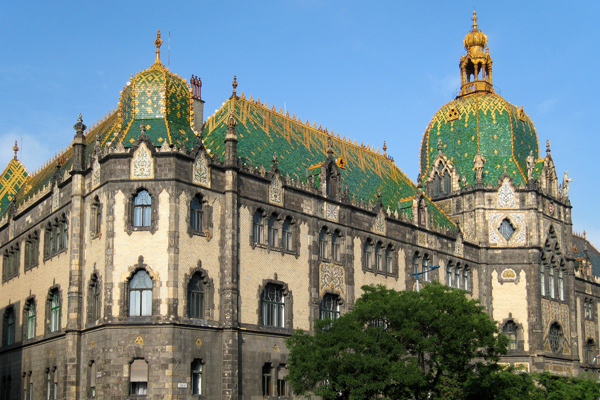
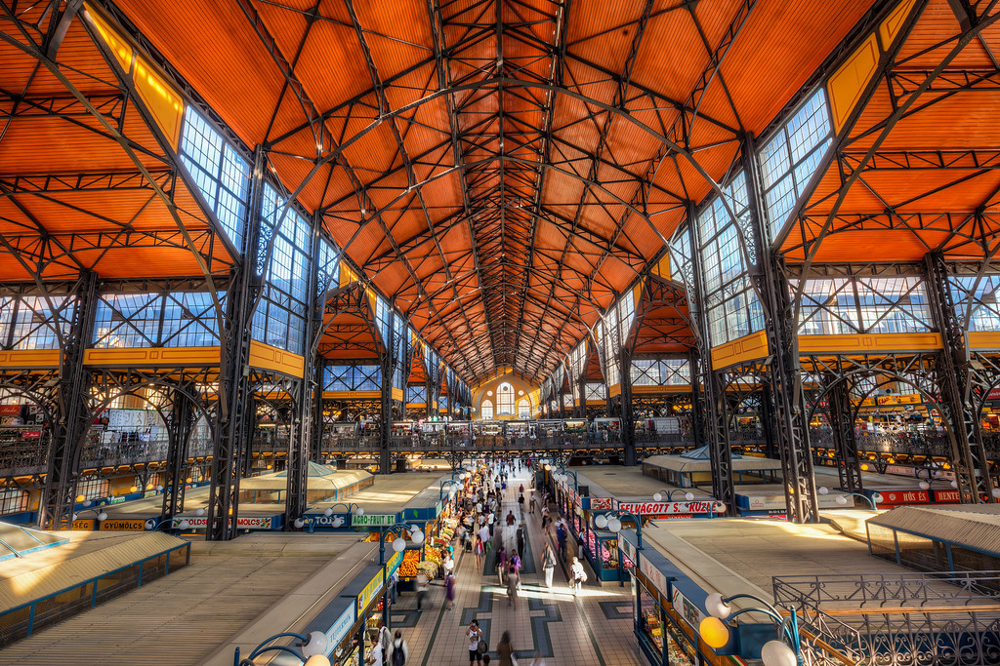

## Centraal Pest

Aan het eind van de 17de eeuw lag een groot deel van Pest in puin, en waren er maar weinig inwoners over. In de daaropvolgende decennia werden nieuwe woonwijken gebouwd, die tegenwoordig de buitenwijken van de binnenstad vormen.
In de 19de eeuw resulteerde de ontwikkelingsplannen in grote huizen en appartementsblokken, sommige met winkels en cafés, en andere gebouwen.
Het prominentste voorbeeld van deze werken is het Hongaars Nationaal Museum.

Rond deze tijd passeerde Pest Boeda als handels-en industriecentrum, wat deels te danken was aan de joodse gemeenschap die een actieve rol speelde in deze ontwikkeling.

Bezienswaardigheden:

- Váci-straat
- Parochiekerk van de binnenstad
- Klotilde-paleizen
- Liszt-muziekacademie
- Nieuwe Theater
- Hongaars Nationaal Museum
- Joodse wijk
- Grote Synagoge
- Holocaustmonument
- Ervin Szabó bibliotheek
- Museum voor Toegepaste Kunst
- Centrale Markthal

#### Váci-straat

De Váci utca is een sfeervolle straat in Boedapest waar je fantastisch kunt winkelen. De Váci Utca loopt van het noordelijk gelegen Vörösmarty Plein in zuidelijke richting tot aan het Fővámplein met de Grote Markthal. Het noordelijke gedeelte van de straat is autovrije en bevat de meeste winkels en een paar bezienswaardigheden.

Ook vroeger was de Váci-straat al een gegoede winkelstraat; de betere klasse kwam hier naar toe om geld uit te geven en gezien te worden.

#### Parochiekerk van de binnenstad

De Parochiekerk van de Binnenstad (Hongaars:Belvárosi plébániatemplom) is een kerkgebouw in de Hongaarse hoofdstad Boedapest en is gelegen in het stadsdeel Pest. Het kerkgebouw stamt van origine uit de 11e eeuw (1046) en staat boven het graf van Sint-Gellért. Het kerkgebouw is het oudste kerkgebouw van Pest. De kerk was van origine romaans. Een klein deel bij de zuidtoren is er nog van te zien (een deel van de muren). In de 14e eeuw werd de kerk verbouwd in gotische stijl en werd gewijd als kathedraal van het toen gestichte bisdom Pest. Tijdens de verovering door de Turken werd de kerk veranderd in een moskee, hier herinnert het gebedsnisje naast het altaar nog aan (het is een richtingaanwijzer naar Mekka). Na de terugverovering van Pest door de Oostenrijkers werd de moskee weer een kerk. Na een grote brand in 1723 werd de kerk tussen 1725 en 1739 herbouwd in barokke stijl, onder leiding van architect Gyõrgy Paur. Het kerkinterieur bevat ook neoclassicistische elementen, deze zijn aangebracht door János Hild. Verder bevinden zich in de kerk 20e-eeuwse werken, zoals het altaar uit 1948 (werd vervangen wegens schade). Dit altaar is beschilderd door de kunstenaars Károly Antal en Pál Molnár

#### Klotilde-paleizen

De Szabadsajtó utca wordt geflankeerd door twee enorme appartementsblokken uit 1902: de Klotildepaleizen (Klotild paloták), die samen een prachtige toegang vormen tot de Elisabethbrug. De gebouwen werden opgetrokken in opdracht van Klotild Mária Adél Amália van Saksen-Coburg en Gotha, naar wie ze genoemd werden, en die gehuwd was met aartshertog József Károly Lajos, zoon van aartshertog József Antal János en Mária Dorottya van Württemberg en broer van koningin Maria Hendrika van België. Ze werden ontworpen door Korb Flóris en Giergl Kálmàn in historicistische stijl, met decoratieve rococo-elementen. Het gebouw rechts is verbouwd tot appartementen en een hotel dat in 2009 werd geopend. In het linkerblok is het café-restaurant Casino Lido gevestigd.

#### Hongaars Nationaal Museum

Het Hongaars Nationaal Museum (Magyar Nemzeti Múzeum) is een museum in Boedapest, dat is gewijd aan de geschiedenis van Hongarije.

Het museum werd gesticht door graaf Ferenc Széchényi, die in 1802 zijn kostbare bibliotheek en later zijn muntenverzameling afstond om een begin te maken met het museum. Het museum is gevestigd in een neoclassicistisch gebouw, dat door Mihály Pollack werd ontworpen en in 1847 in gebruik werd genomen.

In de loop der tijd zijn verschillende onderdelen van het museum afgesplitst: de kunstcollectie verhuisde in 1875 en in 1906 naar respectievelijk de Nationale Schilderijenverzameling (Országos Képtár) en het Museum voor Schone Kunsten, in 1872 werd het Museum voor Toegepaste Kunst opgericht en na de Tweede Wereldoorlog volgden het Etnografisch Museum, het Natuurhistorisch Museum en de Nationale Széchényibibliotheek.

Vanaf de jaren zestig werden enkele historisch belangrijke plaatsen bij het Nationaal Museum ondergebracht: deze filialen zijn de resten van het koninklijke paleis in Visegrád, het kasteel van de Rákóczi's in Sárospatak, het geboortehuis van Lajos Kossuth in Monok, de burchtruïne van Esztergom en de archeologische site van Vértesszőlős.

##### Het gebouw en de collectie

In de voorhal is de grootst bewaarde Romeinse mozaïekvloer te zien. Daarachter begint het trapportaal. Het plafond is bewerkt met fresco's en taferelen uit de Hongaarse geschiedenis. Het leidt naar een ruime, ronde zaal met een koepeldak. Dit vertrek van 15 meter met zuilen, pijlers en nissen vertoont overeenkomsten met het Pantheon in Rome.

Vanaf hier komt men in de zwaarbewaakte pronkzaal, waar zich tot 1999 de Stefanuskroon en de daarbij behorende kroningsattributen bevonden.

Boven een zeer brede toegangstrap staan acht hoge, Korinthische zuilen. Daar, boven in het timpaan (geveldriehoek), zijn allegorische figuren afgebeeld.

De begane grond huisvest voorwerpen uit de geschiedenis van de volken die in Hongarije hebben gewoond van de prehistorie tot 896, ten tijde van Árpád. In de zalen I en II zijn resten te zien van een nederzetting uit de oude steentijd - in 1960 bij Vértesszőlős gevonden - en vondsten uit Sümeg.

In de zalen VI, VII en VIII zijn vondsten uit de Romeinse tijd te zien. Een bijzondere plaats neemt hier de bekende bron uit het paleis van koning Matthias in Visegrád in.

Op de eerste verdieping zijn in zeven zalen verzamelingen opgenomen uit de periode 896-1848. In zaal I bevinden zich voorwerpen uit de voormalige kastelen van Boeda en Visegrád. Vanaf 896 tot de middeleeuwen zijn wapens, helmen, harnassen, enz. te bewonderen. In een van de zeven zalen bevindt zich een compleet uitgeruste Turkse veldheertent met tapijten, kussens en Turks huisraad.

Voor het gebouw staat sinds 1883 een door Alajos Stróbl ontworpen standbeeld van de dichter János Arany. In het park rondom het museum staan ook standbeelden van Hongaarse geleerden en schrijvers

#### Joodse wijk

De oude joodse wijk van Boedapest ligt in het centrum van de stad, in stadsdeel Elisabethstad. Symbool voor deze wijk is de Grote Synagoge, die met maar liefst 3000 zitplaatsen de grootste synagoge van Europa is.

Het wegtrekken van joodse mensen, zowel gedwongen (tijdens WO II) als vrijwillig, heeft voor een minder joods karakter gezorgd. Zo is de wijk tegenwoordig vooral ook in trek onder studenten. De joodse wijk is een goedkoop alternatief geworden als uitgaansbuurt.

De joodse wijk is op dit moment het meest vervallen deel van het centrum van Boedapest.
Grootschalige saneringsplannen zullen in de nabije toekomst het gezicht van deze wijk waarschijnlijk flink doen veranderen.

##### Holocaustherdenkingsboom

De Holocaustherdenkingsboom bevindt zich in het herdenkingspark. De Levensboom, een treurwilg, symboliseert een omgekeerde menora en is vervaardigd uit roestvrij staal met 4000 zilveren blaadjes, die de namen dragen van alle 600.000 in de Tweede Wereldoorlog vermoorde Hongaarse Joden. De boom is ontworpen door de kunstenaar Imre Varga en werd in 1989 geplaatst door de Emánuel Stichting. Op de dubbele zwarte boog die bij de boom is geplaatst, staat de inscriptie: Is er grotere pijn dan die van mij?. Op een gedenksteen staat de bekende Hebreeuwse tekst uit de Talmoed: Wie één ziel redt, redt de hele wereld. Achter dit monument staat een zwarte kolom met vier rode kleinere kolommen, die de niet-Joden symboliseren die Joden hielpen in de Tweede Wereldoorlog: Raoul Wallenberg, Angelo Rotta, Carl Lutz, Giorgio Perlasca en Carlos de Liz Texeira Branquinho.

#### Grote Synagoge

De Grote synagoge van Boedapest (Hongaars: Nagy Zsinagóga; Hebreeuws:בית בית הכנסת הגדול של בודפשט), ook wel genoemd de synagoge aan de Dohánystraat (Tabakstraat) (Hongaars: Dohány utcai zsinagóga) of Tabaksjoel (Jiddisch: Tabak-Shul) is een synagoge in de Hongaarse hoofdstad Boedapest. Het is de grootste synagoge van Europa en de op één na grootste ter wereld[1]. Er is plaats voor ongeveer drieduizend personen. De synagoge staat in de voormalige Jodenwijk, heden ten dage wonen er nog een aanzienlijk aantal Joden. Het gebouw is 75 meter lang en 27 meter breed en werd tussen 1854 en 1859 in Moorse stijl gebouwd, naar het plan van de architect Ludwig Förster. Het geboortehuis van Theodor Herzl (grondlegger van het zionisme) stond naast de synagoge.

##### Geschiedenis

Joden maken reeds lang deel uit van de Hongaarse bevolking. Terwijl koning Stephanus de Heilige de Joden vrijheid en privileges bood, legden andere vorsten, met name Andreas II hen beperkingen op. Tijdens de Turkse overheersing toonde dezen juist respect voor het Jodendom vanwege de gemeenschappelijke wortels in de islam. Reeds in de 11e eeuw woonden er Joden in Boeda en in sinds de 14e eeuw ook in Pest. Door de toenemende welvaart in de 19e eeuw nam het aantal onder hen zodanig toe, dat de bestaande kleine sjoels (synagogen) te klein werden. Aanvankelijk kon men het niet eens worden over de vorm van een nieuwe tempel, maar toen na 1853 de orthodoxe denkbeelden plaatsmaakten voor een vrijere opvatting onder de neologe Joden, werd een prijsvraag uitgeschreven voor het ontwerp. Deze werd gewonnen door de Weense katholieke architect Ludwig Förster.

#### Museum voor Toegepaste Kunst

Oosterse tapijten, 17de-eeuwse aristocratische kostuums, Italiaanse majolica, Zsolnaykeramiek, Sezession-glaswerk, Franse meubels, in het Museum van Toegepaste Kunst vind je te veel om op te noemen. Het was het derde museum in zijn soort in Europa, na Londen en Wenen. Het indrukwekkende gebouw werd in 1896 ingehuldigd door keizer Franz-Josef.

#### Centrale Markthal

De Grote Markthal (Hongaars: Nagycsarnok) van Boedapest ligt aan het Fővám tér in het 9e district. Het is de grootste overdekte markt van Boedapest en is ook een belangrijke toeristische attractie. Het gebouw is ontworpen door Samu Pecz (1854-1922) en werd in 1897 ingehuldigd.

De markthal herbergt 180 winkels die vooral levensmiddelen verkopen: groenten, fruit, vlees, kaas, vis etc. Men vindt er de bekende paprika, tokaji aszú en kaviaar. Vooral de paprika is er in vele soorten, kleuren en maten. Boven in de hal zijn vooral toeristenwinkels gevestigd, waar beschilderde eieren, T-shirts, foto-boeken en tafelkleden gekocht kunnen worden.
