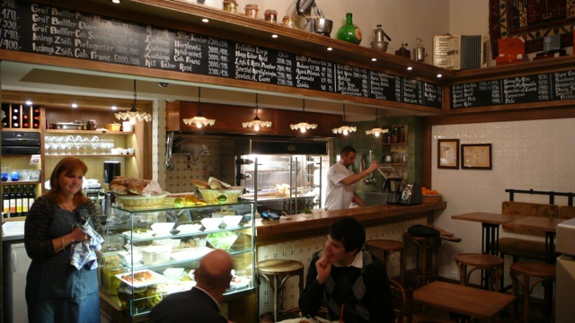

## Waar kunnen we rustig iets eten...

### Aangeraden restaurants op Reddit

Bij deze restaurants is reserveren een must.

#### Ruben

Zeer goede score op [TripAdvisor](https://www.tripadvisor.be/Restaurant_Review-g274887-d1571886-Reviews-Ruben_Restaurant-Budapest_Central_Hungary.html). Ze hebben Oost-Europees, Midden-Europees, Hongaars en gewone keuken.

#### Kispiac Bisztro

Traditionele keuken. [TripAdvisor](https://www.tripadvisor.be/Restaurant_Review-g274887-d3645242-Reviews-Kispiac_Bisztro-Budapest_Central_Hungary.html)

#### Ket Szerecsen

Gezellig restaurant met terras. Mediterraan, Europees, Oost-Europees. [TripAdvisor](https://www.tripadvisor.be/Restaurant_Review-g274887-d786280-Reviews-Ket_Szerecsen-Budapest_Central_Hungary.html)

### Restaurants met een terras

#### Kert Bistro

Vrij duur

#### Gerlóczy cafe & brasserie

Niet goedkoop, maar wel mooi terras

> After an unfortunate season, we can finally enjoy tasty breakfasts and sunshiny afternoons at Gerlóczy’s terrace once again. This place rightfully has the nickname “Little Paris”, as the atmosphere makes us feel like we are in the French capital.

#### Mazel Tov

[Mazel Tov](https://mazeltov.hu/en/) ziet er gezellig, lekker, en niet te duur uit.

> mazel tov is an open hearted cultural space in the city’s center, a streamlined and comforting place focusing on gastronomy in the 7th district, in the middle of the historically jewish quarter, today’s downtown’s night-life center. this urban, recreational, dog-friendly garden laden with planted herbs and trees is transformed into a garden party location in the evenings. we wish to establish an informal, casual atmosphere, an easily digestible urban meeting point, which transforms into one of the most intimate and greenest arbors at dusk, every day of the week.

#### Meer restaurants met een mooi terras...

... zijn hier te vinden: [welovebudapest.com/en/toplists/9-budapest-restaurants-with-enticing-terraces-for-summer-2017/](https://welovebudapest.com/en/toplists/9-budapest-restaurants-with-enticing-terraces-for-summer-2017/)

### Tijd voor een vieruurtje!

#### Kürtőskalács

> The kürtőskalács is a Székely festival cake. it was madefor wedding, baptism or for the receptin of important guests. Its delicious receiprt was altered by the traditions and the different local custom for centuries. Initially, the Székely men baked this dessert after bread baking above the hot ember.The cake made this way was the classical type. Later the wise Székely peoplerealised that the hot, sticky caramel layer of the melt sugar can easily keep the chopped walnut, with which the enjoyable flavour can be enhanced further. After a long time of experimentation our 8 most popular flavours are: vanilla, cinnamon, walnut, almond, chocolate, coconut, cocoa and poppy-seed.

[Website](http://kurtoskalacs.com/en/)
