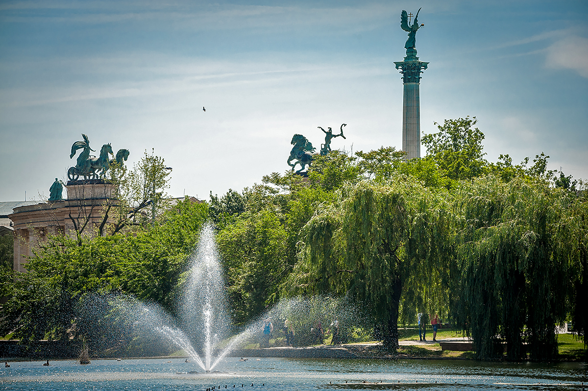
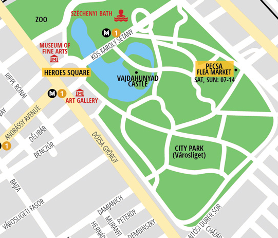
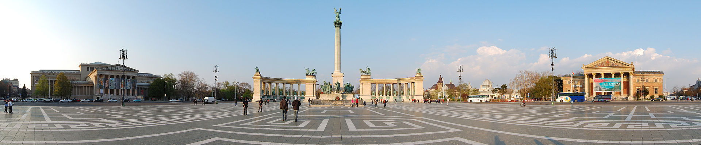
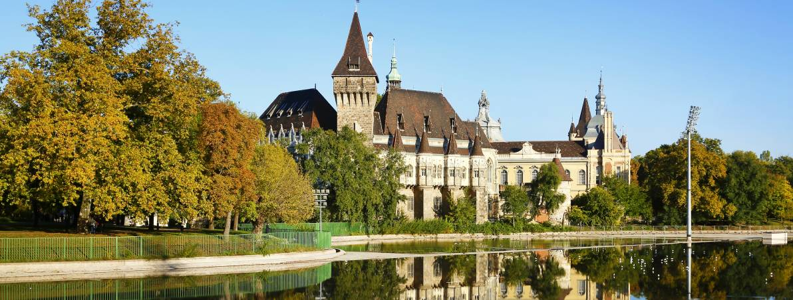
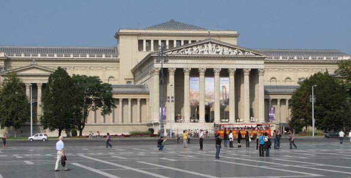
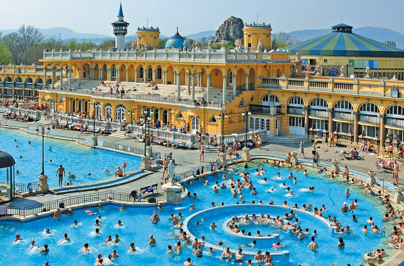
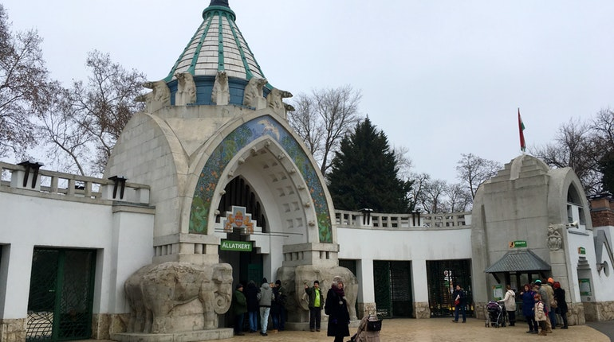
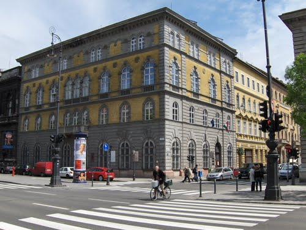

## Városliget, het stadspark

Het stadspark is met ongeveer 1 km2 het grootste park van Pest. Het werd aangelegd in het begin van de 19e eeuw en lag destijds nog ver buiten de stadsgrenzen. Ter herdenking van het duizendjarig bestaan van Hongarije (1896) werd het uitgebreid met onder andere de Vajdahunyadburcht en het Széchenyibad. Het gebied werd een geliefd ontspanningsoord voor alle lagen van de bevolking. Rondom het stadspark staan namelijk het restaurant Gundel, de Állatkert (dierentuin), het Nagycirkusz (circus), het Vidámpark (pretpark), het Vervoersmuseum en het Museum voor Beeldende Kunsten. In het park staan bovendien naast het Széchenyibad en de Vajdahunyadburcht ook nog het Landbouwmuseum en het standbeeld van Anonymus.

Bezienswaardigheden:

- Franz Liszt-museum
- Millennium Metro & Museum
- Museum voor Beeldende Kunsten
- Dierentuin
- Vajdahunyadburcht
- Széchenyibaden
- Millennium Monument (op het Heldenplein)

#### Overzichtskaartje van het stadspark

#### Heldenplein & Millennium Monument

Het Heldenplein (Hősök tere) is een plein in Boedapest, de hoofdstad van Hongarije. Het plein vormt de afsluiting van de Andrássyboulevard en de verbinding tussen de Dózsa György út en de Hungária körút.

Het plein werd vanaf 1896 aangelegd ter gelegenheid van de viering van de duizendste verjaardag van de Hongaarse "landname". Het plein wordt gedomineerd door het Millenniummonument. Aan weerszijden van het plein liggen het Museum voor Schone Kunsten en de Kunsthal. Beide gebouwen werden, evenals het monument, ontworpen door Albert Schickedanz. Achter het plein ligt het Stadspark (Városliget).

Het plein draagt sinds 1932 zijn huidige naam.

#### Vajdahunyadburcht

Het Slot Vajdahunyad ligt achter het Heldenplein op een eiland van de stadsvijver in Boedapest, aan de Pest-zijde.

Achter het Heldenplein ligt de stadsvijver die in de zomer wordt benut door kanoërs en in de winter dienstdoet als ijsbaan. Er vinden dan ijshockey-wedstrijden plaats en er worden internationale schaatswedstrijden gehouden. Op een eiland in de vijver ligt in een park het slot Vajdahunyad, dat hier werd gebouwd ter gelegenheid van het grote feest in 1896. Het is een kopie van het kasteel van Hunedoara in Roemenië. Vajdahunyad is de Hongaarse naam voor de Roemeense stad Hunedoara.

De architect heeft geprobeerd verschillende Hongaarse stijlen in één gebouw te verenigen. Ook rond het kasteel hebben de gebouwen een verschillende stijl. romaans (kerk), gotisch, renaissance en barok (het slot). Het portaal van de kerk is een nabootsing van dat in Ják. Rond de koepel staan vele beelden. Korinthische zuilen dragen de koepel. Opzij van de kerk staat het bronzen beeld van Anonymus. Het is in 1903 door Miklòs Ligeti vervaardigd ter ere van een niet bekende schrijver uit de 12e en 13e eeuw, die vermoedelijk de eerste Hongaarse kroniek heeft geschreven. In het slot is het 'Museum van de Hongaarse Landbouw' ondergebracht, dat het grootste landbouwmuseum van Europa is.

#### Museum voor Beeldende Kunsten

Het Szépművészeti Múzeum ("Museum voor Schone Kunsten") is het belangrijkste museum voor beeldende kunst in de Hongaarse hoofdstad Boedapest. Het staatsmuseum toont Europese schilder- en beeldhouwkunst en heeft daarnaast Egyptische en Grieks-Romeinse afdelingen. Het geniet internationaal vooral bekendheid om zijn collectie Italiaanse meesters uit de renaissance. De hoeveelheid Hongaarse werken is zeer beperkt, sinds de Hongaarse kunst in 1957 werd ondergebracht in een afzonderlijk museum, de Hongaarse Nationale Galerie.

##### Gebouw en geschiedenis

Het museum is gevestigd in een neoclassicistisch gebouw aan het Heldenplein, dat in 1906 in gebruik werd genomen. Tot de oprichting van het museum werd in 1896 besloten ter gelegenheid van de viering van het de duizendste verjaardag van de Hongaarse "landname". De stad Boedapest stelde grond beschikbaar en Albert Schickedanz won de prijsvraag voor het ontwerp van het gebouw, dat architectonisch een eenheid vormt met de tegenovergelegen Kunsthal (Műcsarnok) en het Millenniummonument, die beide eveneens door Schickedanz werden ontworpen.

##### Collectie

Tot de collectie behoren werken van Leonardo da Vinci, Peter Paul Rubens, Rembrandt van Rijn, Quiringh van Brekelenkam, Rafaël Santi, Albrecht Dürer, Paul Cézanne, Lucas Cranach, Giovanni Antonio Boltraffio, Henri Toulouse-Lautrec en Thomas Gainsborough. De kern van de collectie bestaat uit de Nationale Schilderijenverzameling (Országos Képtár), waarvan de basis in 1871 werd gelegd, toen de Hongaarse staat de beroemde privécollectie van de familie Esterházy aankocht, waartoe onder meer het schilderij Madonna met het Kind en Johannes (1508, bijgenaamd de "Esterházy-madonna") van Rafaël Santi behoorde.

Het museum omvat 23 zalen en 17 kabinetten. Daarnaast behoort een afzonderlijk Vasarelymuseum in het derde district van Boedapest tot de museumorganisatie.

De vergevorderde plannen voor een door de EU gefinancierde ondergrondse uitbreiding van het hoofdgebouw werden in 2011 door de Hongaarse regering herroepen.

#### Széchenyibaden

Het Széchenyibad (Hongaars: Széchenyi Gyógyfürdő és Uszoda) is één van de vele kuuroorden in het Hongaarse Boedapest. Het is het grootste medicinale kuuroord van Europa. De warmwaterbronnen die voor de toevoer zorgen zijn 73,5°C en 77°C.

Een eerste badhuis op deze plek (geopend 30 juni 1881) werd voorzien van water uit een door mensen geslagen bron van 970m diep met een temperatuur van 73,5°C. Het water, dat ook gedronken kan worden, is rijk aan mineralen. Er wordt een helende werking aan toegeschreven. Het badhuis, het enige openbare badhuis van Pest, was van meet af aan zeer populair bij de bevolking. Al gauw kon het bad de toeloop niet meer aan. Vandaar dat het badhuis in 1913 werd vergroot wat resulteerde in een welhaast nieuw badhuis op dezelfde plek in neobarokke stijl, en werd vernoemd naar graaf István Széchenyi. De bestaande bron voerde daarna niet meer voldoende water aan. In 1938 werd een tweede bron geslagen, de Szent István (Sint Stefan) bron, met een diepte van 1246m en een temperatuur van 77°C, die 6000 m3 (6 miljoen liter) water per dag aan voert. Door de jaren heen, heeft het bad nog verschillende kleinere verbouwingen gekend. Zo is het bad uitgebreid met onder meer sauna's en een restaurant. Plannen voor een hotel waren er ook, maar die zijn nooit uitgevoerd. Het bad ligt in het stadspark van Boedapest: Városliget.

Het kuuroord heeft drie buitenbaden met temperaturen variërend van 26°C tot 38°C. Binnen bevinden zich 15 bassins met water van verschillende samenstelling en van verschillende temperatuur. Ook zijn hier vier verschillende de sauna's op negen plekken te vinden.

Het water van het Széchenyicomplex wordt ook gebruikt voor curatieve- en therapeutische doeleinden. Zo vinden er in het water gymnastieksessies, fysiotherapiesessies en balneotherapiesessies plaats.

Het kuuroord is te bereiken via de M1-lijn van de metro van Boedapest, station Széchenyi fürdő.

#### Dierentuin

De dierentuin van Boedapest (Hongaars: Fővárosi Állat- és Növénykert, dat wil zeggen Hoofdstedelijke Dieren- en Plantentuin) dateert uit 1866 en is de grootste en oudste dierentuin van Hongarije. Tot de jaren vijftig was het zelfs de enige dierentuin van het land. De dierentuin bevindt zich in de westelijke hoek van het Városliget (Stadspark), naast het Vidámpark (Lunapark) en het bekende restaurant Gundel. Tegenwoordig bestaat de collectie uit ongeveer 3.000 dieren en meer dan 700 soorten.

De dierentuin van Boedapest werd geopend in 1866. Voor de opening schonk keizer Frans Jozef 34 dieren, terwijl zijn echtgenote Sisi de eerste giraffe bijdroeg. Aan het begin van de twintigste eeuw werd de dierentuin tussen 1909 en 1912 volledig opnieuw ingericht onder leiding Károly Kós en Dezső Zrumeczky met diverse bijzondere gebouwen, zoals het fazantenhuis in de voor Kós kenmerkende Transsylvanische stijl. Het olifantenhuis ("Elefántház") en de toegangspoort werden ontworpen door Kornél Neuschloss. Het "Elefántház" is vormgegeven als een oosters paleis en één van de mooiste voorbeelden van de Jugendstil in Boedapest.

Sinds het begin van de 21e eeuw wordt de dierentuin deel voor deel gerenoveerd. In 2008 werd een nieuw savannegebied ("Szavannakifutó") geopend dat bestaat uit een gemeenschapverblijf voor antilopen, giraffen en witte neushoorns en het "Szavannaház", een gebouw waar kleine zoogdieren, hagedissen en geleedpotigen worden gehouden. In 2010 volgde een Australisch gebied. Het Ausztrálház omvat onder meer een nachtdierengedeelte en volières voor papegaaien. Rondom dit gebouw liggen verblijven voor kangoeroes, wombats, mierenegels en helmkasuarissen.

Een ander noemenswaardig gebouw is het "America Tropicana", waar in zeven themagebieden diverse soorten dieren en planten uit tropisch en subtropisch Amerika worden gehouden. Het centrale gebouwdeel richt zich op Amazônia. Aan beide zijden van het gebouw bevinden zich drie vleugels, gethematiseerd naar Manú, Iguazú, de Orinoco-delta, Okefenokeemoeras, Chihuahuawoestijn en de Caribische eilanden. "Varázshegy" is een permanente tentoonstelling over de ontwikkeling van het leven op Aarde, waar ook diverse kleine zoogdieren, zangvogels, reptielen, vissen en geleedpotigen te zien zijn.

#### Franz Liszt-museum

Die neorenaissancistische hoekhuis werd in 1877 ontworpen door Adolf Lang.
Boven de ramen van de tweede verdieping zijn bas-reliëfs aangebracht van beroemende componisten Bach, Mozart, Haydn, Erkel, Beethoven en Liszt zelf.
Liszt woonde niet alleen in dit huis, maar stichtte ook de muziekacademie in Boedapest.
