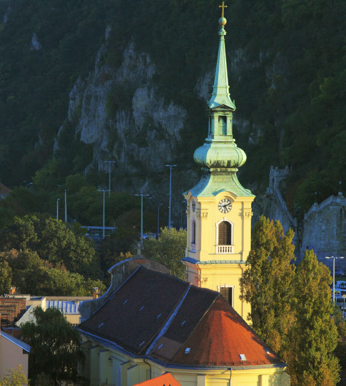
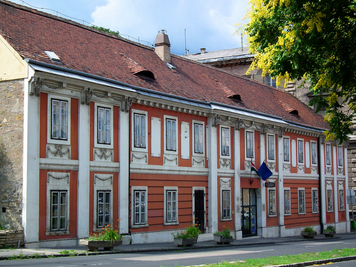

## Tabán

Tabán bestaat nu uit een aangenaam park en enkele historische gebouwen, maar zag er ooit heel anders uit.
In de vroege 20ste eeuw was dit het gebeid tussen de Burchtheuvel en de Gellért-heuvel, een sloppenwijk, die als onderdeel van een stadsverbeteringsprogramma werd gesloopt.
Slechts enkele gebouwen, waaronder de parochiekerk van Tabán, bleven bewaard.

#### Parochiekerk

#### Semmelweismuseum voor Medische geschiedenis

Dit bizarre museum toont de medische vooruitgang van de Romeinse tijd tot nu. Het probeert wel de focus te leggen op de Hongaarse medische kunsten.

Er is een replica van een 19de-eeuwse apotheek en een oorspronkelijke operatiekamer.