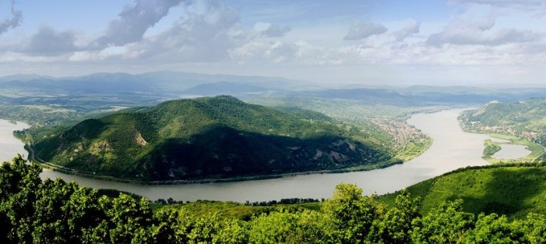
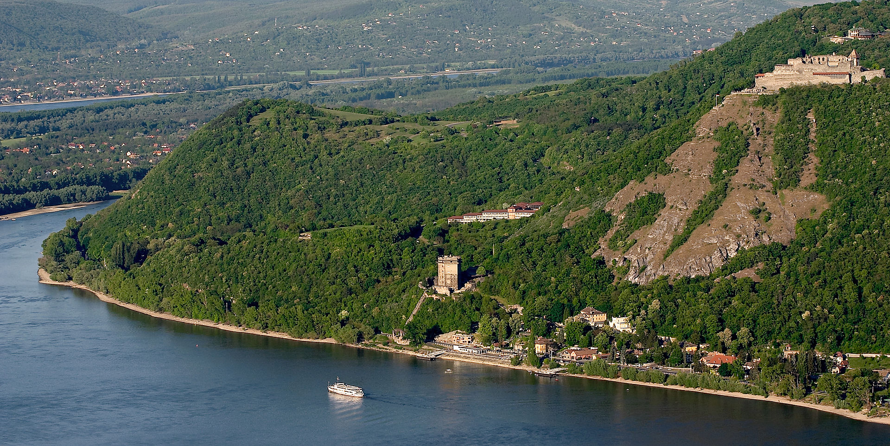
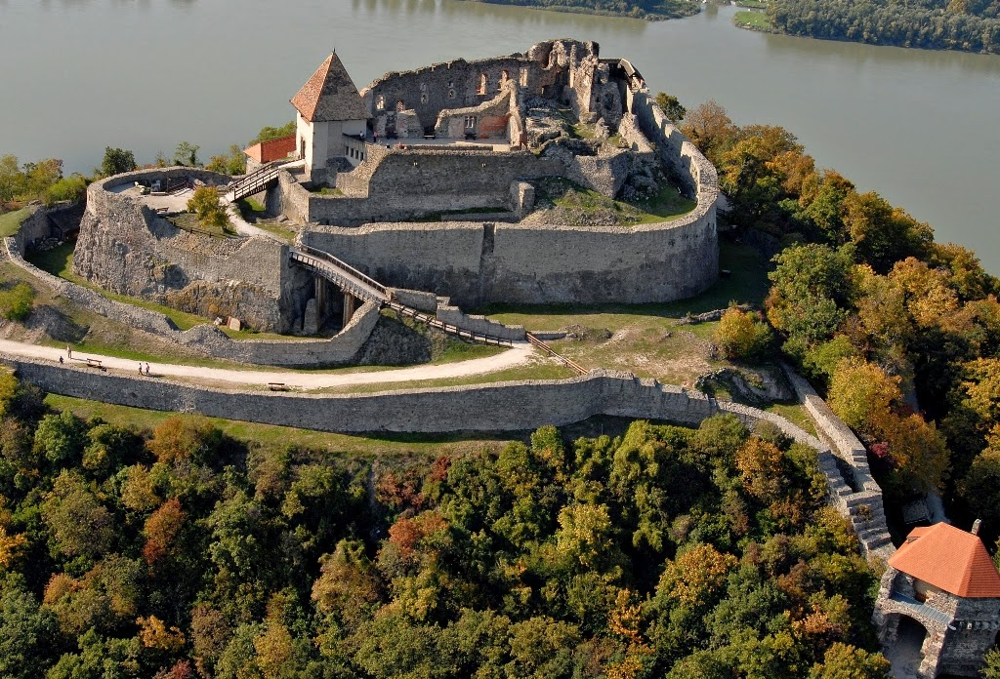
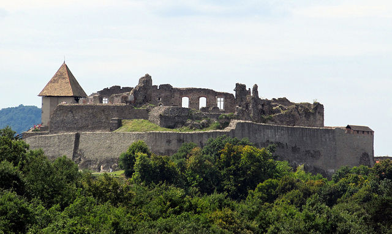
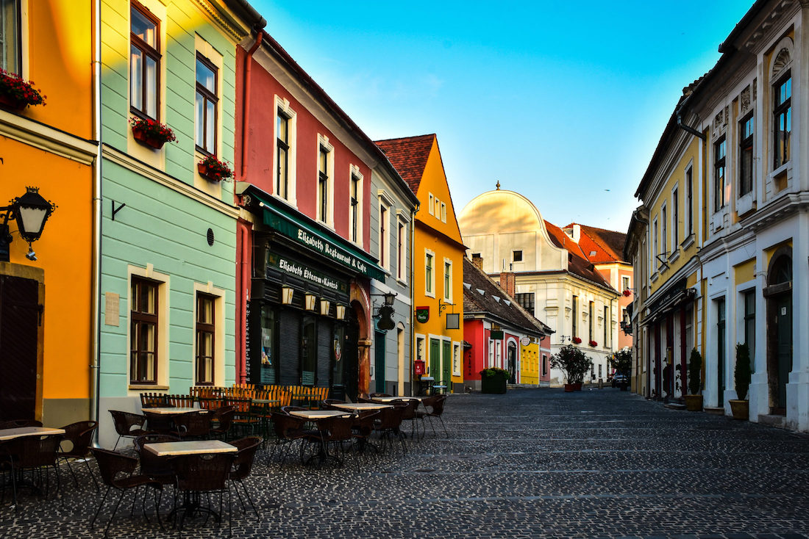
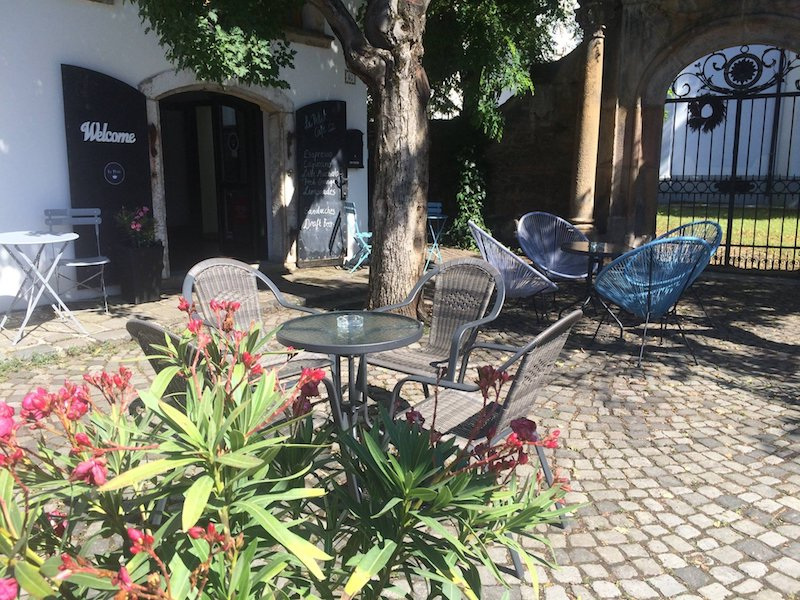

## Tripje naar Visegrád en Szentendre

Voor de daguitstap verlaten we de stadsdrukte en volgen we de Donau stroomopwaarts tot in Visegrád.
In Visegrád kunnen we al wandelend genieten van de natuur. Voor het avondeten nemen we dan de boot tot in Szentendre waar we in een rustig dorpje kunnen genieten van het avondeten.

#### Transport tot aan de bocht van de Donau en terug

We kunnen ofwel [per boot](http://www.mahartpassnave.hu/en/timetable/danube-bend-excursion-boat-lines/budapest-szentendre-visegrad/) (2750 Ft) van Boedapest naar Visegrád ofwel per trein (650 Ft) en dan de overzet vanuit Nagymaros naar Visegrád (420 Ft). De trein vertrekt in Budapest-Keleti.  
De boot trip van Boedapest naar Visegrád duurt zo'n 3 uur.

Voor de terugweg is het simpelste om de boot te nemen naar Szentendre (1650 Ft) en na het avondeten de boot (22OO Ft) of de bus terug van Szentendre naar Boedapest.  
De boten varen blijkbaar wel niet laat meer terug.

#### Visegrád

Visegrád (betekent *"Hoge Burcht"*) is een kleine stad aan de Donau in het district Szentendre (comitaat Pest) in Hongarije. Het is bekend om de blootgelegde resten van een koninklijk paleis.

Het plaatsje ligt 22 km ten noorden van Szentendre, tegenover Nagymaros, aan de Donauknie en 42 km ten noorden van Boedapest. Het plaatsje kreeg in 2000 stadsrechten, hoewel het maar zo'n 2.000 inwoners telt.

Vlakbij bevindt zich de beroemde Donaubocht. De rivier maakt hier een draai van 90 graden. Boven het dorp bevinden zich de resten van de voormalige burcht waar koning Matthias in de 15de eeuw verbleef. Het was ooit een luxueus paleis waar talrijke marmeren fonteinen de binnenplaats sierden.  
In de buurt staat ook de Salamon-toren: met zijn vijf verdiepingen een van de beste bewaarde middeleeuwse woontorens in Midden-Europa.

#### Burcht van Visegrád

De burchtheuvel van Visegrád bestaat uit drie hoogten: het onderste met het koninklijk paleis, het middelste met de Salamon-toren en de bovenste met de burcht.

Vanaf de Donau-oever vergt het een flinke wandeling ernaartoe, maar de beloning is groot. Vanaf de burchttoren is het panorama op de Donau geweldig.

##### Koninklijk paleis

Het eerste koninklijk paleis werd gebouwd onder Charles I, nadat hij en zijn hof verhuisde naar Visegrád in 1316. Het werd honderd jaar later met veel Italiaanse ornamenten versiert, waardoor het haar reputatie als een van de mooiste paleizen in heel Europa kreeg. Tegenwoordig bestaat het paleis grotendeels uit ruïnes – het legendarische paleis werd pas herontdekt in de jaren 1930 – het paleis maakt indruk vanwege haar afmetingen en het fantastisch uitzicht over de Donau en het omliggende gebied. Het is leuk om te verkennen terwijl je je probeert voor te stellen hoe het hier moet hebben uitgezien in zijn hoogtijdagen.

Vanaf Föutca nr. 27 komt u via een gang met nissen, waarin zitjes zijn aangebracht, op de schitterende pronkhof met in het midden de opvallende achthoekige Hercules-fontein.

Ook interessant is het afwateringskanaal op de rotsenhof, dan wel de fundamenten ervan. Via een trap komt u uit op de lagergelegen binnenplaats; vandaar leiden andere trappen naar boven naar de kapel en een gang voert naar de prachtige marmeren Leeuwenfontein. Het koninklijk paleis had ooit een vloeroppervlak van 600 bij 300 m.

##### Salomon-toren

De woontoren uit de 13de eeuw beheerst het tweede niveau. Ooit hield men hiervandaan het verkeer op de weg langs de oever in de gaten en werd er tol geïnd. De 8 m dikke muren van het zeshoekige bouwwerk zijn 31 m hoog. Hij draagt de naam Salomon omdat koning Ladislaus I rond 1080 zijn broer Salomon in de toren liet opsluiten, omdat deze op zijn troon aasde.

##### Hoge burcht

Op het derde en laatste niveau bieden de overblijfselen van de muur van de hoge burcht een goed uitzicht op het omringende land. Vanaf de Salomon-toren leidt een steile weg naar boven, maar ook via de bochtige autoweg met zijn prachtige uitzichten kunt u er komen.

De burcht uit de 13de eeuw met zijn ongelijkmatige grondvlak bestaat uit drie binnenplaatsen. Met dit stelsel wilde men verhinderen dat een eventueel binnengedrongen vijand gemakkelijk verder kon komen. De verbinding tussen de drie binnenplaatsen bestond uit smalle poorten of een ophaalbrug.

#### Szentendre

Szentendre ligt aan de rechteroever van de Donau, en telt ongeveer 23.000 inwoners. De naam van de stad is afgeleid van de Sint-Andreaskerk die hier in de middeleeuwen werd gebouwd. Szentendre ligt 20 km ten noorden van Boedapest. De weg vanuit de hoofdstad leidt via een licht hellende straat in de richting van het hoofdplein, het driehoekige Fő tér.

Het stadje Szentendre heeft grillige hellingen. Er zijn koffiehuizen (eszpresszó-kavéház), winkels en boetieks. Aan het Fő tér staan alle gebouwen op de monumentenlijst; ze vormen een bonte verzameling van stijlen en kleuren. Op het plein staat een bewerkt smeedijzeren kruis uit de 18e eeuw. In de huizen, de meeste met één verdieping, woonden welvarende kooplieden en handwerkers. Nu zijn er winkels, boetiekjes en cafés in gehuisvest.

In Szentendre barst het van de galerieën. Het stadje huisvest een belangrijke kunstenaarskolonie. In 1928 ontstond de vereniging van kunstschilders van Szentendre. Nog altijd lokt het plaatsje kunstenaars van allerlei slag.

Even buiten het centrum heeft de tijd stilgestaan in het nationale Openluchtmuseum. In dit Hongaarse Bokrijk werden driehonderd oude gebouwen, afkomstig uit tien regio's, met veel liefde heropgebouwd en leven ook oude tradities verder.

Langs de Donaupromenade vind je de betere restaurants, waar zowel de betere goulashbereidingen als meer verfijnde gerechten worden geserveerd.

#### Avondeten

Szentendre lijkt me een gezellig stadje om 's avonds rustig een gezellig restaurantje te zoeken.
Wel zien dat we de vervoer regelen om terug naar Boedapest te geraken.

