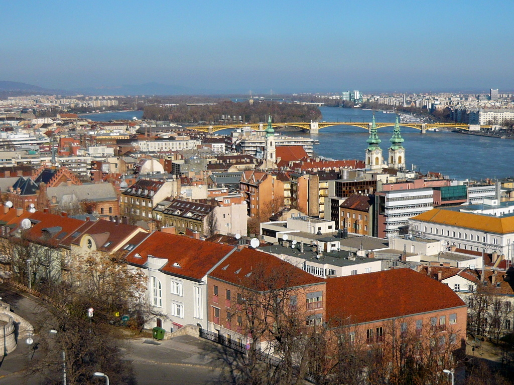
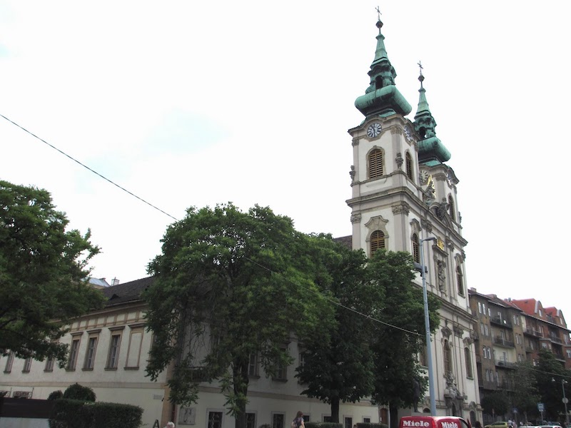
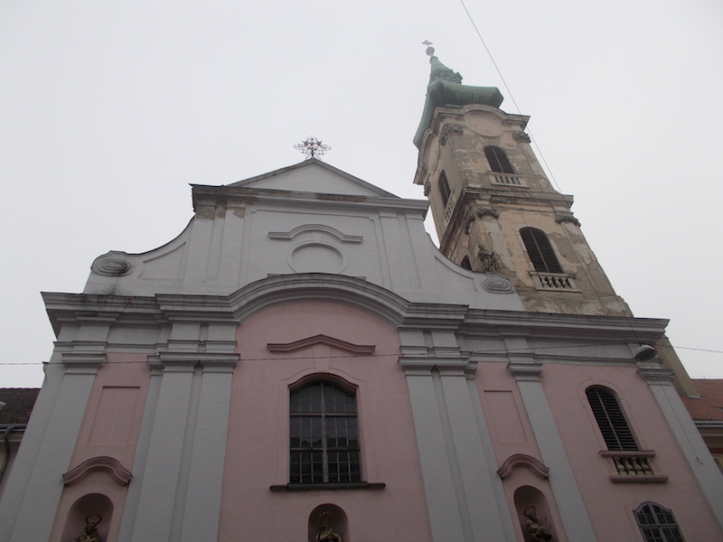
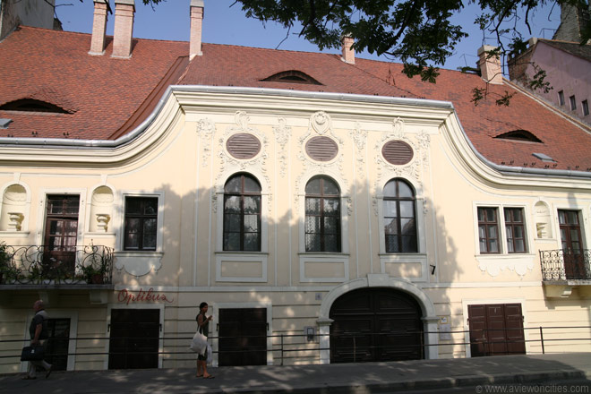
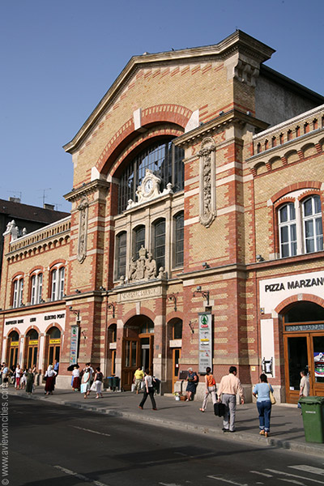
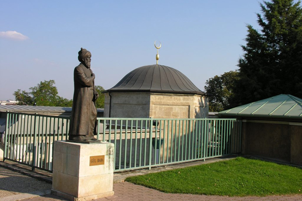

## Víziváros, de Waterstad

De Waterstad (Víziváros) ligt beneden aan de voet van het Vissersbastion (Halászbástya) aan de Boeda-zijde van Boedapest.

Lang geleden liep een belangrijke weg in de Romeinse tijd van het gebied bij de huidige Kettingbrug (Lánchíd) in de richting van Aquincum. In de Middeleeuwen was het de hoofdstraat van de voorstad van Boeda, de zogenaamde "Waterstad" (Víziváros). Ook nu nog heet de straat "Hoofdstraat" (Fő utca). Tot de Turkse tijd lag deze wijk, waar vooral vissers, koop- en handwerklieden woonden, nog binnen de vestingburcht. De Turken legden hier vele baden aan, waarvan er nog enkele behouden zijn. De Fő utca begint bij het Clark Ádám tér, aan de Boeda-zijde van de Kettingbrug. Hier begint ook de kilometertelling voor alle van Boedapest uitgaande hoofdverkeerswegen. Bij het kleine standbeeld op een symbolische kilometersteen staat de inscriptie 0 km (Miklós Borsos).

Bezienswaardigheden:

- Sint-Franciscuskerk
- Herberg Het Witte Kruis
- Batthyány-plein
- Sint-Annakerk
- Calvinistische kerk
- Samu Pecz monument
- Kapucijnenkerk
- Kapisztory-huis
- Graf van Gül Baba
- Verscheidene baden
- Tunnel van Clark Adam

#### Sint-Annakerk

De Sint-Annakerk (Szent Anna-templom) is een barokke kerk aan het Batthyányplein in Boedapest.

De bouw van de kerk begon in 1740. De aanvankelijke architect was Kristóf Hamon. Na diens dood in 1748 zette Máté Nepauer het werk voort. In 1761 was de kerk gereed.

De buitenkant wordt overheerst door twee fraaie torens. De façade is versierd met beelden, met in het midden de Heilige Anna met de Maagd Maria gemaakt door Károly Bebo en schilderingen van de Weense schilder Franz Wagenschön. De ovale koepel is binnen voorzien van fresco's van een onbekende Hongaarse schilder, alsmede een aantal van schilders van deze tijd. Enkele zuilen omgeven het barokke hoofdaltaar.

#### Sint-Franciscuskerk

De noordzijde van het Batthyány-plein wordt begrensd door een groot rood gebouw, het voormalige Sint-Elisabethklooster. De kerk van het klooster, gewijd aan de heilige Franciscus, heeft een weelderig versierd barok interieur. Voor het klooster staat het standbeeld van Ferenc Kölcsey, een Hongaarse dichter die vooral gekend is als auteur van het nationale volkslied van Hongarije.

#### Herberg Het Witte Kruis

Aan de westkant van het Batthyány plein bevindt zich de voormalige herberg Het Witte Kruis (Fehér Kereszt fogadó), een huis in rococo-stijl dat in de 18e eeuw onstond door het samenvoegen van twee bestaande woningen.  Herberg Het Witte Kruis, Batthyany-plein, Boedapest
Herberg Het Witte Kruis
Het was een van de eerste herbergen in Boedapest en het heeft naar verluidt enkele voorname gasten ontvangen waaronder keizer Jozef II en de legendarische vrouwenversierder Giacomo Casanova.
Het verhaal gaat dat Casanova, die hier verbleef om in de nabijgelegen Rác-baden te herstellen van een ziekte, een meisje uit de buurt versierde. De vader van het meisje, een slager, was niet bepaald gelukkig met de affaire en met een hakbijl in de hand verjoeg hij Casanova de stad uit.

#### Hirsch-huis

Het aanpalende huis, op nr 3, is eveneens interessant. Het zogenaamde Hirsch-huis heeft een laat-achttiende-eeuwse gevel in Lodewijk XVI stijl en is versierd met reliëfs die de vier seizoenen uitbeelden. Het wordt dan ook vaak het vier seizoenen-huis genoemd (Négy Évszak ház).
Net zoals zijn buur ligt het gebouw een stuk onder het plein; in de negentiende eeuw werd het straatniveau verhoogd om een einde te maken aan de voortdurende overstromingen.

#### Markthal

Eveneens aan de westkant van het plein ligt de oudste overdekte markthal van Boeda, oorspronkelijk gebouwd in 1902 naar een ontwerp van Pál Klunzinger. Het bakstenen gebouw met stalen geraamte werd tijdens de Tweede Wereldoorlog vernield, maar later weer heropgebouwd. Tegenwoordig biedt het onderdak aan een supermarkt.

#### Graf van Gül Baba

De tombe van Gül Baba, ligt goed verscholen op de Rozenheuvel en is te bereiken via een pittoresk, steil klimmend straatje, de Gül Baba utca.

De tombe is gewijd aan deze Ottomaanse dichter en derwisj, die na zijn dood in 1541 heilig werd verklaard door Suleiman the Magnificent. Daardoor is het het meest noordelijk gelegen islamitische heiligdom. De tombe overleefde de slag om Buda waarbij de Turken werden verslagen ongeschonden en werd in gebruik genomen als kapel door de Jezuïten. In de 19e eeuw werd het toegankelijk gemaakt voor Moslim pelgrims. In de jaren negentig werd de tombe uiteindelijk verkocht aan de Turkse overheid, die de plek wederom tot pelgrimsoord hebben gemaakt. Tegen betaling is het graf te bezichtigen, maar het is zeer onzeker dat het graf daadwerkelijk de overblijfselen van de derwisj bevat.

Het park achter de Tombe is een fijne en rustige plek. De Rozenheuvel biedt uitzicht over een deel van de stad, ook zijn er indrukwekkende 19e eeuwse villa’s te vinden.